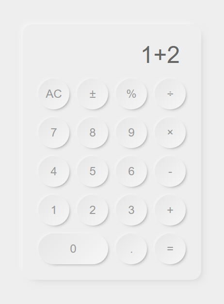
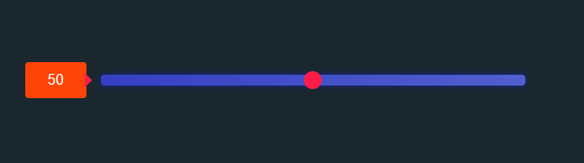
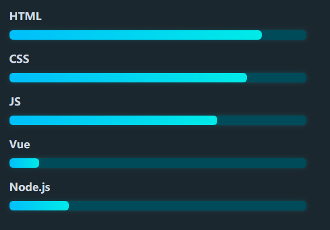
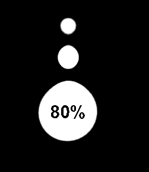
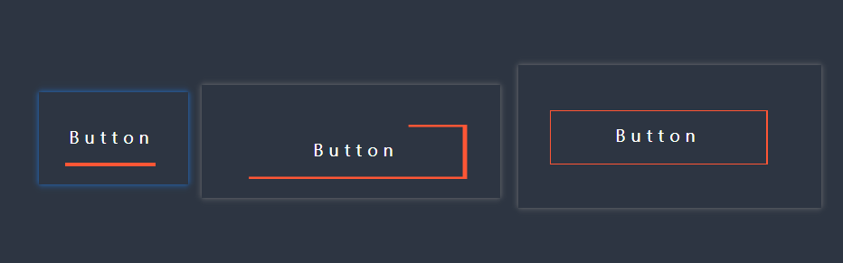
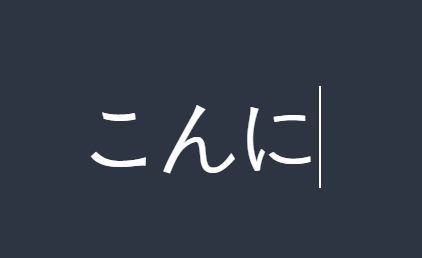
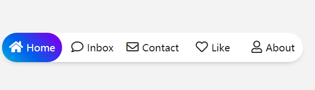
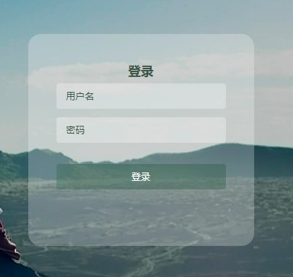
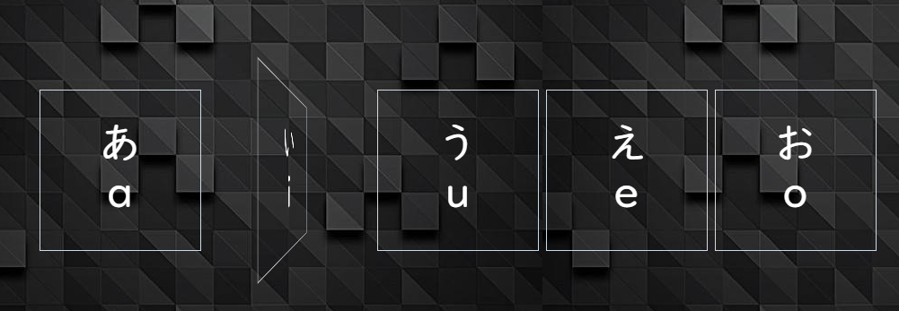

# EdLearnASimpleHTML

### 1. 3dPic

### 2. 简易版新拟态风格计算器（Vue）

### 3. Ghost漂浮动画

### 4. Hover图标发光特效

### 5. 滑动选择器

### 6. Nav导航动画

### 7. 进度条

### 8. 上传按钮（动画）

### 9. 水滴动画

### 10. 按钮边框动画

### 11 菜单背景悬浮

### 12. 打字机效果

### 13. 弹性nav切换

### 14. 登录表单

### 15. 图片翻转

